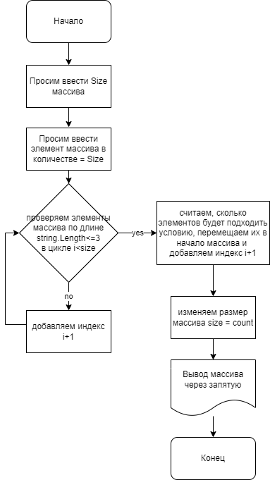

# My-final-examination-work
Итоги блока. Выбор специализации. Передовые технологии.

## Задача:
Написать программу, которая из имеющегося массива строк формирует массив из строк, длинна которых меньше либо равна 3 символа. 
Первоналчальный массив можно принять вводом, либо задать захардкодить. 
При решении коллекции не желательны, работа с массивами в приоритете. 
Пример: `["Hello", "2", "world", ":-)"] -> ["2", ":-)"]`

### Описание программы:
Программа просит ввести размер массива.
После ввода размера массива нужно ввести значение каждой ячейки массива вручную.

Метод `FillArray` принимает значения с клавиатуры методом `InpMessage` и вставляет в ячейки массива поочерёдно, начиная с нулевого-индекса.

Метод `PrintArray` выводит массив в квадратных скобках и кавычках через запятую в строку.

Метод `FilterArray` считает количество элементов массива, которые подходят по условию `<=3`, после чего выводит эти элементы в левую часть массива и срезает лишнюю часть при помощи метода `Resize.Array`, который принимает массив и выдаёт новый с размером `count`. После всего производится вывод по методу `PrintArray`

